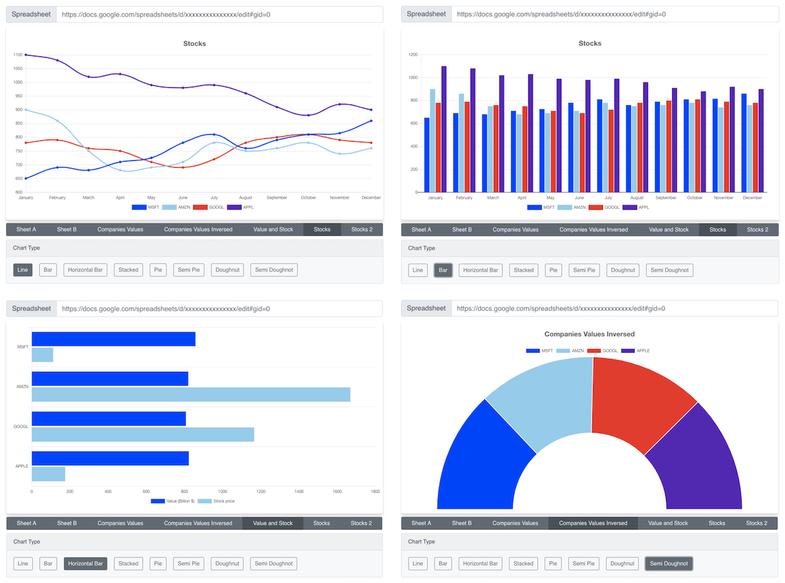

# Smart Chart

Transform Google sheets to pretty charts!

## How to Install

Clone the repository and run the following commands:

    > npm install
    > npm start

Once setup is done, the app will be available on http://localhost:3000

## How to use

Paste your Google Sheet URL in the Spreadsheet field, Smart Chart will fetch the data and process it.

You can switch between different sheets, pick chart type, modify the Rows and Columns to process, flip Rows & Columns, modify colors and other..

## Spreadsheet format

In order to successfuly generate a chart, the Spreadsheet should have Row titles, Column titles and Values, example:

