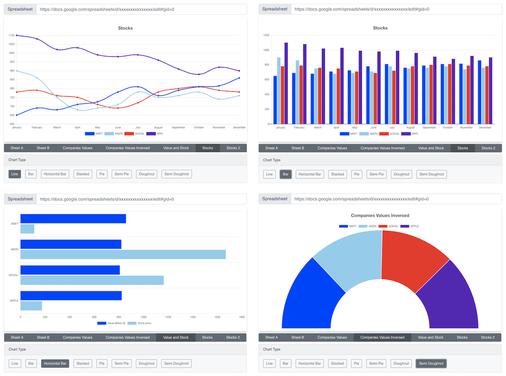
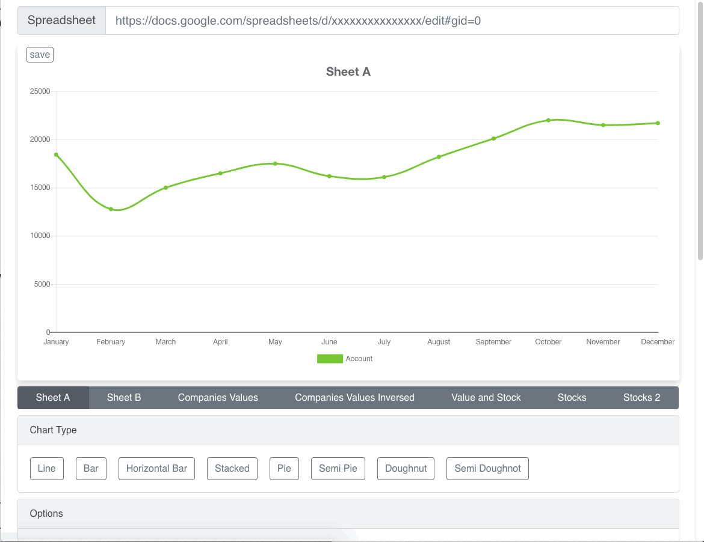
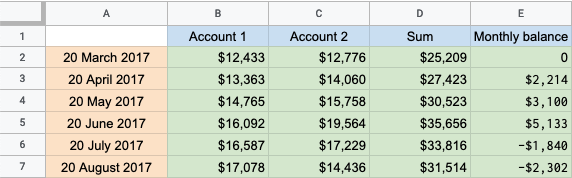

# Robo Chart

Transform Google sheets to pretty charts!



## How to Install

To install the React Component, please check [this link](https://github.com/postlight/react-google-sheet-chart).

To setup this repository, follow these steps:

1. Clone the project:

   > git clone https://github.com/postlight/robo-chart-web.git

2. Generate a Google API Key: https://console.cloud.google.com/apis/credentials
3. Rename `.env.sample` to `.env` and paste the generated API Key in the `REACT_APP_CHART_TOKEN` field
4. run the following commands:
   ```sh
   npm install
   npm start
   ```

Once setup is done, the app will be available on http://localhost:3000

## How to use

Paste your Google Sheet URL in the Spreadsheet field, Robo Chart will fetch the data and process it.

You can switch between different sheets, pick chart type, modify the Rows and Columns to process, flip Rows & Columns, modify colors and other..



## Spreadsheet format

In order to successfuly generate a chart, the Spreadsheet should have Row titles, Column titles and Values, example:



## License

Licensed under either of the below, at your preference:

- Apache License, Version 2.0
  ([LICENSE-APACHE](LICENSE-APACHE) or http://www.apache.org/licenses/LICENSE-2.0)
- MIT license
  ([LICENSE-MIT](LICENSE-MIT) or http://opensource.org/licenses/MIT)

## Contributing

Unless it is explicitly stated otherwise, any contribution intentionally submitted for inclusion in the work, as defined in the Apache-2.0 license, shall be dual licensed as above without any additional terms or conditions.

---

🔬 A Labs project from your friends at [Postlight](https://postlight.com/labs)
